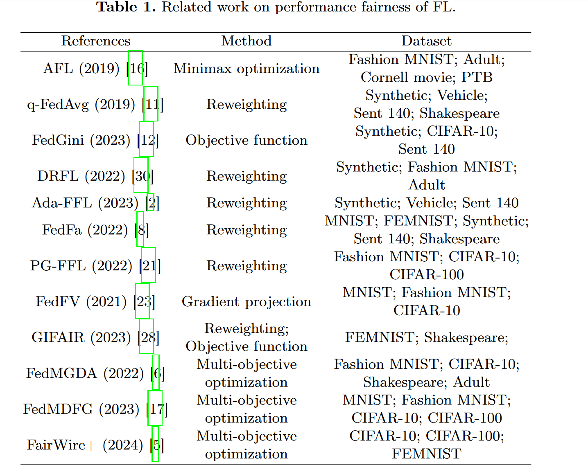
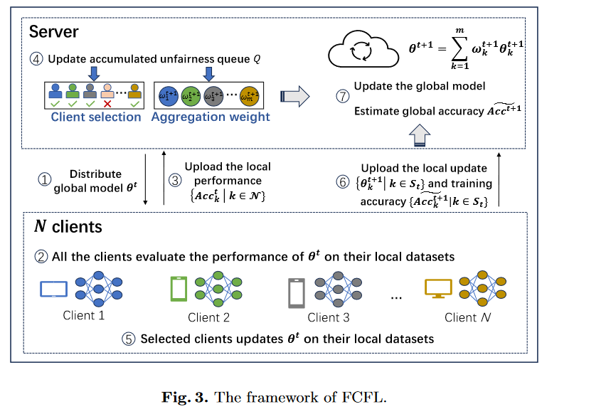
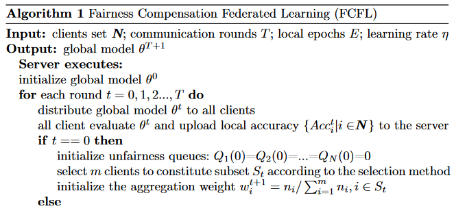
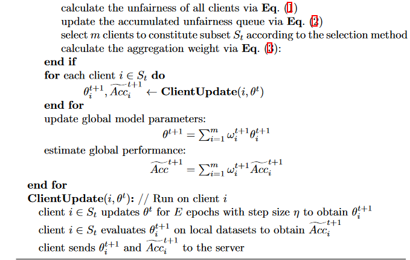

# FCFL: A Fairness Compensation-based Federated Learning Scheme with Accumulated Queues

## Abstract
问题：联邦学习本地数据的异构性导致的性能不公平

目前解决方法：通过在聚合时reweighting clients来解决，忽略了客户端选择的影响

提出的方法：FCFL，Fairness Compensation-based Federated Learning
- 通过`累积队列`来累积每个客户端的不公平性。
- `公平性补偿`: 动态选择客户端，自适应调整聚合权重
- 参数可调，$\alpha=0$时为fedavg

结果：2 benchmarks，保持accuracy，公平性指标提升了30.4%

## Introduction
1. 联邦学习提出的背景：数据增长带来的通信和存储负担；存在不愿意共享数据的客户端；隐私保护条例的制定。
2. 联邦学习的局限性：本地数据和全局模型的divergence，导致性能不公平性。不公平性主要表现在由于用户选择偏见或者表示数据少数的弱势客户端上。
3. 已有方法——忽略了客户端选择的影响
- AFL：minimax optimization，优化性能最差的client
- q-FedAvg：引入参数q, 对参与者损失函数重新加权
- DRFL：动态调整分配给每个客户端的权重，参数调优更加灵活
- 客户端选择或是随机选取或是根据数据量，会导致不公平性。
4. FCFL。训练阶段时更新不公平队列，基于累积不公平值，队列被用于客户端选择和重新加权
5. 本文的工作：
- 1. `累积不公平值`和`累计不公平队列`   
- 2. `公平性补偿`方法，平衡了客户端选择和聚合权重。
- 3. 实验评估

## Related Work
Fairness in FL can be divided into `collaborative fairness`, `group fairness`,`selection fairness`, and `performance fairness`, as per different fairness goals.
collaborative fairness: 考虑到不同客户端的贡献。
group fairness: 基于敏感属性最小化不同群体的差异。
selection fairness: 每个客户都有公平的机会被选中参与训练。
`performance fairness`: 降低全局模型在不同参与者性能的方差

### 联邦学习的性能公平性
fedavg: 根据训练数据量加权平均聚合，导致了性能不公平
AFL：minimax optimization，最大化性能最差的client。无法泛化于大规模场景
q-FedAvg：引入参数q, 对参与者损失函数重新加权，降低了性能差距。
提高q-FedAvg的性能，包括`designing novel objective functions`, `reweighting`,`eliminating gradient conflicts`, and `multi-objective optimization`
1. `designing novel objective functions`:
- fedgini: 引入`Gini penalty term`
- gifair；引入正则化项来惩罚不同客户端群体的差异
- AdaFFL: 引入正则化局部损失项和`Frobenius distance`来设计自适应公平FL。
2. `Reweighting`:
- fedfa: 结合训练精度和频率设计权值选择算法，使用双动量梯度优化加快收敛。
- PGFLL：强化学习实现重加权，基于Gini cofficient和准确率设计reward function来实现自动学习策略。
- DRFL：动态调整分配给每个客户端的权重，参数调优更加灵活。
- gifair: 正则化项也可以看作为低准确率参与者分配较高权重的动态reweighting。
3. `eliminating gradient conflicts`:
导致联邦学习不公平性的原因：`conflicting gradient`
- FedFV首先使用`余弦相似度`来检测梯度冲突，然后通过修改梯度的方向和大小来迭代消除冲突，从而提高FL的公平性。
4. `multi-objective optimization`:
- FedMGDA: 将联邦学习转化为一个多目标优化问题，使用多重梯度下降`a multiple gradient descent algorithm`。
- FedMDFG：`增加一个公平驱动的目标`来寻找一个公平的下降方向，line search strategy可以保证合适的步长。
- Fairwire+: 考虑了无线信道的inherent noise，基于噪声梯度设计算法，找到适合所有客户端的共同下降方向。

### 联邦学习的客户端选择
客户端选择可以实现不同的目标
- Power-of-Choice：识别出每轮损失最大的客户，并将其纳入训练以提升模型性能
- GreedyFed：基于Shapley值选择贡献度最高的客户，提高了模型精度和收敛速度
- FairFedCS 利用Lyapunov optimization实现了更好的selection fairness。

## Proposed Method
1. 问题定义
- 性能公平性： 准确率更平均，公平性指标更高
- 目标：保持accuracy，降低准确率方差

2. Overview of FCFL
- 性能公平性的原因：数据异质性导致弱势客户无法公平地选择。为了消除不公平性，基于弱势客户的不公平程度提供补偿。为了maintain computation cost, 为弱势客户提高了选择频率，分配更多的聚合权重。
- 同时考虑client selection 和 aggregation reweighting。

3. accumulated unfairness queues
$uf_i^t=\begin{cases}\widetilde{Acc}^t-Acc_i^t,&if \widetilde{Acc}^t>Acc_i^t\\0,&otherwise\end{cases}$
- $Acc_i^t$: 第i个客户端在第t轮的准确率
- $\widetilde{Acc}^t$: 所有客户端在第t轮的准确率的加权平均值，表示全局模型在第t轮的准确率的估计值。
- $$uf_i^t$$: 第i个客户端在第t轮的不公平值。累计值，表明优先级。

用一个队列来追踪每一个客户在每一轮的不公平值，并根据累积不公平值来选择客户端。
$Q_i(t)=\max\begin{Bmatrix}Q_i(t-1)+\alpha uf_i^t-\omega_i^t\cdot\mathbf{1}_{[x_i(t-1)=1]},0\end{Bmatrix}$
- $x_i(t-1)$: 第i个客户端在第t-1轮是否被选择，1表示被选择，0表示不被选择。
- $\alpha$: 控制公平性超参数

$Q_i(t)$设计的原则，会补偿被不公平对待的客户：
- 低准确率的客户端，表示整体不公平的累积值
- 未选择的客户端，没有减去的项
- 低权重客户，累积不公平值有个较小的惩罚

4. client selection and aggregation reweighting
- 客户端选择：根据累积队列选择客户端，选择$Q_i(t)$ top-m的客户
- 聚合权重
$\omega_i^{t+1}=\begin{cases}\frac{n_i}{\sum_{i=1}^mn_i},&if&Q_1(t)=...=Q_m(t)=0\\\\\frac{Q_i(t)}{\sum_{i=1}^mQ_i(t)},&otherwise\end{cases}$
- remark: 仅仅根据不公平性选择客户会导致全局模型会偏向弱势客户，表现为另一种不公平性。因此，引入了超参数r平衡两种不公平性。随机选择r个客户，其余的用上面提到的方法。

5. analyse of communication and computation overhead
通信开销增加小
计算小也可以忽略不计

## Experiments-待复现

1. 实验设置-数据非独立同分布的场景
mnist 100 clinets
cifar 100 clients
shakespeare 31 clients

2. FCFL的公平性
降低了方差
3. FCFL的性能
可以快速收敛，引入的通信成本小
4. 超参数r的影响
5. `ablation experiments`
- 随机选择代替不公平的选择
- 数据量重新加权代替基于不公平性的重加权

## Conclusion
性能不公平性 
FCFL
累积队列;客户端选择;aggregation reweighting
未来工作：以近似全局性能去估计不公平性；以自适应选择超参数提高整体性能；将该方法和selection fairness结合。

silver bullet：万能丹
is manifested in: 表现在
