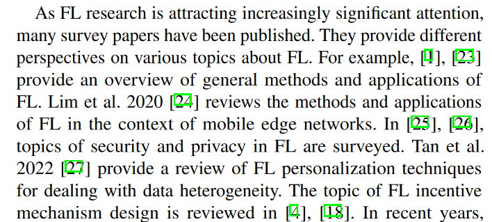
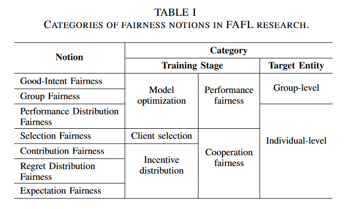
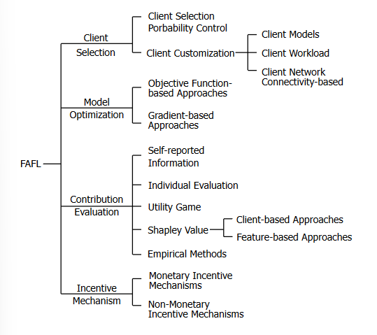

# towards fairness-aware federated learning

## Abstract
研究该领域的目的：目前研究主要关注中心控制器，忽略了客户端，导致客户端被不公平对待，无法积极参与到训练过程中。

本文的工作：考虑基本定理，简化假设，已有的fairness notions，提出了FAFL的分类；讨论了实验指标，建议未来的研究方向

总结了哪些解决方案（对该领域理论的分类）：`client selection`, `optimization`, `contribution evaluation` and `incentive distribution`(激励分配)。

## Introduction
1. FL中的安全聚合后的步骤为`基于贡献评估激励`和`激励分配`
2. 数据数量、数据质量、本地客户端的资源均存在差异，导致对最终全局模型的贡献存在差异，会导致接收到的benifits存在差异
3. 不公平性出现在客户端选择、优化、贡献评估、激励分配等步骤中
- `客户端选择`：已有的选择算法注重中心服务器利益，弱能力客户端无法参与到训练，导致无法得到适合本地数据分布的模型；无法获得激励。这会导致全局模型泛化性不强，客户端可能存在已有模型不存在的样本
- `优化`: 最小化一个特定分布下的损失函数，该特定分布无法体现整个训练数据集的多样性，对局部数据集存在预测偏差。
- `激励分配`：激励往往被用于补偿客户端的资源消耗。全局模型被分配给所有客户忽略了本地更新不一致的事实（数据质量和训练能力）。这对联邦学习贡献较大的参与者不公平。 `freeride issue`
- `贡献评估`：促进`客户选择`和`激励分配`的公平性。评估可以根数数据量、数据质量、marginal model improvement。
4. 一方面，不公平会阻碍客户端参与到训练，另一方面，一味不考虑贡献也会导致不公平，模型的泛化能力下降。

Q: 激励分配是否和性能公平性相悖？

## common assumptions-HFL
1. Fundamental assumptions
- 客户端数据敏感，不应暴露给任何人
- 服务端和客户端是自私的、理性的

2. Simplifying assumptions
- 客户端参与者可信
- 服务器可信
- 数据拥有者愿意参与到联邦学习中
- 关于客户的前置信息可用
- 一个客户端完全将资源使用到联邦学习训练中
- 联邦学习训练过程中，客户本地数据保持不变
- Monopoly fl server

## notions of fairness in FAFL
动机和联邦学习中考虑的利益相关者存在差异
- `performance distribution fairness`:测量FL客户端性能的一致性程度来泛化standard accuracy parity。`individual fairness`
- `good-Intent fairness`:最小化被保护组的最大损失，避免牺牲其他组来过拟合任何模型，数据集被分为不同组，优化性能最差的组，降低组间准确率方差。`eventual users`
- `group fairness`:最小化不同群体决策之间的差异。算法决策的差异使用`demographic parity`和`equal opportunity`来衡量。`eventual users`
- `selection fairness`:增加代表不足或从未代表的客户的参与机会来减轻FL模型中的偏差。如设置采样约束；客户端选择和他们的消耗或可能的贡献成正比。`individual fairness`
I: 将selection fairness和performance distribution fairness结合起来，和在采样约束上，将操作系统的选择相关的概念引入，用于客户端的选择
- `contribution fairness`:收益应该和对联邦学习的贡献成正比。`monetary and non-monetary FL incentive schemes`
- `Regret distribution fairness`:最小化客户由于等待激励的regret difference。`未来收益`
- `expectation fairness`:在一段时间内，随着激励报酬的逐步发放，在不同时间点上最小化客户之间的不公平。`未来收益`

performance fairness:相似性能
cooperative fairness:客户端被公平对待，吸引更多参与进来
individual-level fairness：不同客户端的相似性能
group-level fairness：消除对特定利益相关者群体的偏见

## the proposed taxonomy in FAFL

强调公平性概念，方法和限制
1. Fairness in FL Client Selection

以中心服务器利益为目标，使用threshold-based方法，选择高性能客户端。可能会导致特定群体的oversampling，导致performance deterioration；部分弱势客户端可能无法参与到联邦学习，获得激励，导致架构的不持久性。

客户端选择可以进一步分类为1）考虑公平因素，确保每个客户都有合理的概率被选择；2）为每个客户端定制模型和训练过程。

1）FL Client Selection Probability Control:研究采样约束，保证低参与率的客户也能参与到训练中。更公平的 FL 客户端选择策略可以提高最终的准确性，但由于涉及更多约束，但以训练效率为代价。一些客户端算法在设计公平参数时没有考虑客户的实时贡献，可以通过reputation table来解决。

2） Client Customization：低算力的客户端会被服务器视为阻碍，因此需要根据客户端能力动态调整FL框架和训练过程，确保低代表性的客户端也能参与到训练中。

*Customizing Client Models*：一些FAFL工作利用了dropout技术来调整FL模型，以减少基于阈值的客户端选择方案引起的偏差。

通过使用`Federated Dropout`，算力低的客户可以通过训练修剪后的子模型来加入FL。不过FD随机丢弃激活节点未解决神经网络的分解问题，将神经网络视为黑盒未检查神经网络内部结构的变化。`adaptive federated dropout(AFD)`方法，mountain an activation score used to select important activation nodes group to generate sub-model that best fit each client.

`FD`和`AFD`的限制：在同一轮对所有客户端提供相同的剪枝模型，没有考虑如何为不同客户端提供不同的剪枝子模型（强能力客户的能力受限）；在推理时没有考虑计算优势。

`ordred dropout(OD)`, 根据客户端能力分配子模型。`OD`丢弃的是相邻组件而不是随机神经元。相似计算能力的客户划分为`cluster`，相同cluster的客户端使用相同的`dropout`比例。算力差的客户使用知识蒸馏来提高模型性能。推理时可以去除不重要的单元来减低推理成本。

*Customizing Client Workloads*：为FL客户定制工作量以增强公平性。能力较低的客户端分配的工作较少，以使他们能够通过`threshold-based`的 FL 客户端选择。

*customizing based on client network connectivity*: 通信能力差的客户端较少可能被聚合到全局模型，导致了模型bias。

2. fairness in model optimization

优化时的bias会造成模型歧视特定被保护群体；模型以其他客户为代价过拟合特定用户。解决方法为：1）*objective function-based approaches*，2）*gradient-based approaches*。

1） objective function-based approaches

优化联邦学习的全局/局部目标，满足目标公平性约束。

AFL目的是good-intent fairness，防止模型过度拟合任何特定客户而牺牲其他客户。AFL只在少数客户端时的性能较好，存在规模限制；q-FFL目的是performance distribution fairness。两种方法都缺乏鲁棒性。FedMGDA+ 提高鲁棒性和good-intent fairness，`gradient normalization`和`受切比雪夫方法启发的内置鲁棒性方法`可用于增强对于`inflated loss attack`的鲁棒性。Ditto 作为一种多任务联邦学习算法，也可以提高鲁棒性和公平性。

以上方法主要关注`performance distribution fairness`，也有一些关注`group fairness`的工作。比如AgnosticFair,FCFL。

2） gradient-based approaches
计算更公平的客户端更新平均值，以实现客户端统一的性能。

FedFV 在对全局目标函数中的梯度进行平均之前，减轻 FL 客户端之间的梯度冲突，已被证明能够在公平性、准确性和效率之间取得平衡。然而，用于减轻外部冲突的梯度估计方法可能并不总是可靠，因为基于前几轮的估计梯度可能会变得过时并且与最新更新不兼容。

3. fairness in contribution evaluation
贡献评估会影响客户选择和激励机制。贡献评估可以分为：1）`self-reported information` 2）`individual evaluation` 3）`utility game` 4）`Shapley value` 5）`empirical methods`

1) self-reported information, 包括数据数量、数据质量、收集数据成本，算力和通信能力；这些方法假设客户有能力且值得信赖，以便他们能够可靠地评估自己的情况并如实报告信息。实际上，这个假设可能并不成立。

2) individual evaluation, 根据客户在特定任务上的表现来衡量客户的贡献。它关注的是个人表现而不是 FL 模型的整体表现。

`reputaion mechanism`被用于追踪参与者的历史贡献，可被用于中心化和去中心化联邦学习架构。在中心化架构中服务器要有准确和平衡的验证集；去中心化架构中reputation的两个源头：任务发布者的直接观点；其他任务发布者的间接观点（存储在区块链）。

还有其他方法来评估 FL 客户的个人贡献，比如score function、组间相互评估。

individual evaluation的假设： 1）FL服务器和FL客户端都是可信的； 2）具有与其他参与者的模型（或全局模型）相似的本地模型的参与者被认为提供了更多的贡献。这在实践中可能并不成立。

3) utility game, 与`profit-sharing`方案相关，将`utility`映射为`rewards`，profit-sharing方案有以下三种：egalitarianism （团队utility均等分配）、marginal gain:（加入团队带来的utility 与加入的顺序有关）、marginal loss（离开团队失去的utility，最常用）

marginal loss反应的是相对概念，不能反映数据实际价值，`shapley value`被利用解决这个缺点

4) Shapley value，边缘贡献，平均不包含 i 的 D 的所有子集的边际贡献之和。
$\phi_i=C\sum_{S\subseteq N\setminus\{i\}}\frac{U(M_{S\cup\{i\}})-U(M_S)}{\binom{n-1}{|S|}}$

client-based approaches 通过利用基于梯度的SV估计方法，评估FL客户贡献的效率可以显著提升，然而仍需要在每轮训练中评估不同客户子集的子模型，为了解决此问题，一些进一步降低计算量的方法被提出。

feature-based approaches SV值可以在VFL中计算特征重要性

5) empirical methods
基于数据的假定的贡献评估方法存在计算量大、计算不精确的问题。贡献评估的经验主义方法可以作为基于理论进行客户贡献评估的替代项。

4. fairness in incentive distribution
训练成本和安全风险会阻碍客户的持续参与，FL应设计令人满意的补偿协议来促进公平性，如考虑贡献和训练消耗。

激励分配可以分为：1）`monetary incentive` ,monetary payoffs;2）`non-monetary incentive`,使用不同性能的FL模型来激励。

1) monetary incentive, 如`Fmore`。激励更多优质数据所有者加入FL，同时最小化总成本。FMore的一个缺点是在客户选择上没有考虑公平性。

除了准确评估每个客户的贡献之外，公平的激励机制还需要保证每个客户根据其对FL模型的贡献得到公平的报酬（简称贡献公平）。该类方法受限于self-report的真实性。解决方法为RRAFL,利用reputaion间接反映数据所有者的质量和可靠性，而不是要求他们自我报告。该方法依赖于性能历史记录的可用性.

contract theory被用于设计联邦学习激励方案，不过缺点是假设了只有一个任务发布者的垄断市场。

## FAFL evaluation metrics

## promising future research diretions

## Conclusions
基本假设、main notions、taxonomy and challenges in each step、evaluation metrics、future research directions

Fairness-aware Federated Learning (FAFL)
interdisciplinary  跨学科
By examining the fundamental and simplifying assumptions, as well as the notions of fairness adopted by existing literature in this field, we propose a taxonomy of FAFL approaches covering major steps in FL, including client selection, optimization, contribution evaluation and incentive distribution。
attrition  失去
system heterogeneity  系统异质性
statistical heterogeneity  统计异质性
discriminate against     歧视
vice versa  相反，反义亦然

lyapunov optimization: 基于Lyapunov函数的优化方法,将长期的性能指标分解到每个时间片进行优化,适用于需要在不确定性环境中进行优化的场合，如通信网络和排队系统。

Exp3算法是一种用于对抗性多臂老虎机（adversarial multi-armed bandit）问题的在线学习算法。在对抗性多臂老虎机问题中，一个学习者（学习算法）在一系列时间步骤中选择一个动作，然后一个对手（adversary）为每个动作分配一个损失。学习者的目标是最小化累积损失，同时考虑到不确定性和对手的适应性。

Exp3算法的核心思想是使用指数加权平均来更新动作的概率分配。算法在每一步都会根据之前的经验计算每个动作的损失估计，并使用这些估计来更新选择每个动作的概率。这种更新方式结合了探索（探索那些可能带来较低损失的动作）和利用（选择当前损失最小的动作）的策略。

Combinatorial Multi-Armed Bandit (CMA) 是一种扩展自传统多臂老虎机（Multi-Armed Bandit, MAB）问题的模型，它适用于更复杂的场景，其中玩家可以选择多个臂（或多个组合臂）的组合，并观察到与这些臂相关的奖励。

在传统的 Dropout 方法中，会在训练过程中随机丢弃一部分神经元，以防止过拟合并提高模型的泛化能力。Federated Dropout 采用了类似的概念，但是为了减少通信量，它会在服务器端生成多个子模型，每个子模型通过以不同的比例丢弃神经元来创建。然后，这些子模型被发送到不同的客户端进行训练。这个过程可以减少每个客户端需要处理的数据量，从而减少了通信成本。

`inflated loss attack`:膨胀损失攻击，是一种数据投毒攻击，其目的是通过在训练数据中注入恶意构造的数据点来破坏模型的性能。这种攻击通常会导致模型在预测时产生较高的损失，因此被称为“膨胀损失攻击”。

核重赋权函数`kernel re-weighting functions`通常在统计学和机器学习中用于处理数据分布的变化，特别是在处理协变量偏移（covariate shift）时。在这种情况下，训练数据和测试数据的分布不一致，核重赋权函数可以帮助模型更好地适应测试数据的分布。

